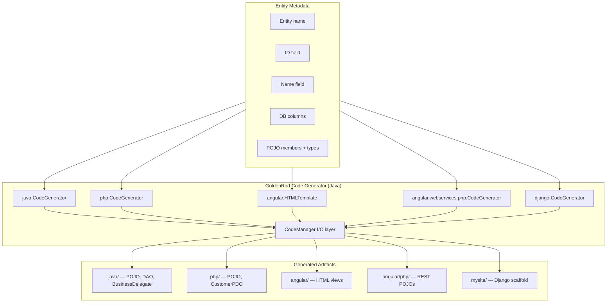
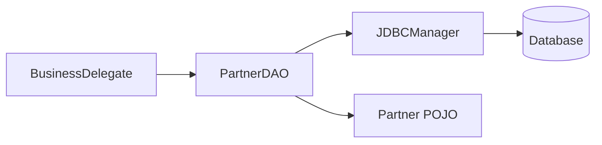
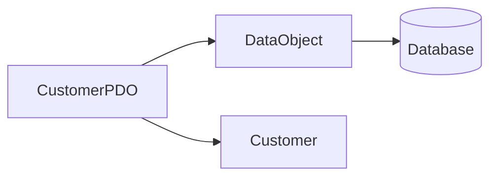
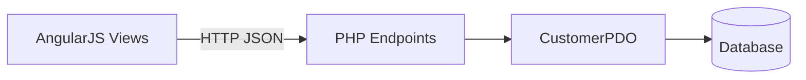

# GoldenRod Architecture

GoldenRod is a multi-target **code generation engine** that produces CRUD-oriented application layers from entity metadata. A Java-based generator (`org.archcorner.codegen`) emits source files for Java (JDBC), PHP (PDO), AngularJS front ends, and Django project scaffolding. Generated artifacts are written directly to output folders under the GoldenRod project root.

## System Context



## High-Level Structure

```
GoldenRod/
├── src/org/archcorner/codegen/     # Generator engine (Java source)
│   ├── java/                       # Java JDBC stack generation
│   ├── php/                        # Standalone PHP generation
│   ├── angular/                    # AngularJS HTML generation
│   │   └── webservices/php/        # PHP backend for Angular views
│   └── django/                     # Django project scaffolding
├── bin/                            # Compiled generator classes
├── java/                           # Generated Java output (example: Partner)
├── php/                            # Generated PHP output (example: Customer)
├── angular/                        # Generated AngularJS views + PHP services
└── mysite/                         # Generated Django project shell
```

## Architectural Layers

### 1. Orchestration Layer — `CodeGenerator`

Each target stack exposes a `CodeGenerator` class with `main()` entry points that accept entity metadata and invoke generation methods:

| Module | Package | Primary methods |
|--------|---------|-----------------|
| Java | `org.archcorner.codegen.java` | `generatePojo`, `generateDAO`, `generateBusinessDelegate` |
| PHP | `org.archcorner.codegen.php` | `generatePojo`, `generateDAO` |
| Angular PHP | `org.archcorner.codegen.angular.webservices.php` | `generatePojo`, `generateDAO` (output to `angular/php/`) |
| Django | `org.archcorner.codegen.django` | `writeSettings`, `writeViews`, `writeUrls` |
| Angular HTML | `org.archcorner.codegen.angular.HTMLTemplate` | `getCode`, `getFormCode`, `getEditFormCode`, `getDeleteFormCode` |

Generators build SQL fragments dynamically from column lists (INSERT, UPDATE, SELECT, DELETE) and configure template objects before writing files.

### 2. Template Layer

Templates assemble target-language source as strings from structured metadata:

| Template | Purpose |
|----------|---------|
| `ClassTemplate` | Class name, optional superclass |
| `MemberTemplate` | Fields / SQL constant members |
| `MethodTemplate` | Method signature and access |
| `ParameterTemplate` | Method parameters |
| `VariableTemplate` | Local/method variables (PHP) |
| `PojoTemplate` | Entity class with getters/setters |
| `DAOTemplate` | Data-access class with CRUD methods |
| `BusinessDelegateTemplate` | Java service layer delegating to DAO |
| `HTMLTemplate` | AngularJS list, create, edit, delete pages |

Each template's `getCode()` method delegates string construction to `CodeManager` helper methods (e.g. `openClassCode`, `getMemberGetterCode`).

### 3. I/O Layer — `CodeManager`

`CodeManager` handles filesystem operations per target:

- Create output directories (`createFolder`)
- Open target files (`createClass`, `createHTML`, `createFile`)
- Stream generated code (`writeCode`, `closeClass`)

Output paths are relative to the working directory when the generator runs (e.g. `java/`, `php/`, `angular/`, `angular/php/`).

## Generated Application Architectures

### Java Stack (3-tier JDBC)



- **POJO**: Plain entity with private fields and public getters/setters.
- **DAO**: JDBC `PreparedStatement` CRUD — `getHighestId`, `getById`, `getByName`, `insert`, `update`, `delete`, `getAll`.
- **BusinessDelegate**: Thin facade that instantiates `PartnerDAO` per method call and delegates.

External dependency: `org.archcorner.chartreuse` (`JDBCManager`, package layout for POJO/DAO).

### PHP Stack (PDO)



- **POJO**: PHP class with `$_`-prefixed private properties and getter/setter methods.
- **CustomerPDO**: Extends `DataObject`; uses named PDO parameters (`:customerid`, `:name`, etc.) for CRUD.

### AngularJS + PHP REST Stack



Four HTML pages per entity:

| Page | HTTP call | Purpose |
|------|-----------|---------|
| `{Entity}s.html` | GET `{Entity}s.php` | List all records |
| `{Entity}Form.html` | POST `Insert{Entity}.php` | Create record |
| `Edit{Entity}Form.html` | POST `Get{Entity}.php`, POST `Update{Entity}.php` | Load and update |
| `Delete{Entity}Form.html` | POST `Delete{Entity}.php` | Delete record |

Uses AngularJS 1.2.1 from CDN; `$http` with JSON payloads.

### Django Stack

Scaffolding only — generates:

- `settings.py` with configurable database engine
- `views.py` with a simple `index` view
- `urls.py` for app and project routing

The bundled `mysite/polls` app is a standard Django starter; models are not auto-generated.

## Design Principles

1. **Metadata-driven generation** — Entity name, ID column, display-name column, DB column list, and POJO member list drive all outputs.
2. **Template composition** — Small template objects compose into full source files; no external templating engine.
3. **Convention over configuration** — Predictable naming: `{Entity}DAO`, `{Entity}BusinessDelegate`, `{Entity}Form.html`, `Insert{Entity}.php`.
4. **Stack isolation** — Each target package is independent; shared concepts (MemberTemplate, DAOTemplate) are duplicated per package rather than abstracted into a common library.
5. **Write-to-disk output** — Generators emit files directly; there is no intermediate AST or IR.

## Technology Stack

| Layer | Technology |
|-------|------------|
| Generator runtime | Java (Eclipse JDT project) |
| Java output | JDBC, plain Java classes |
| PHP output | PHP with PDO |
| Front end | AngularJS 1.2.1 |
| Web scaffold | Django (Python) |
| Build | Eclipse Java Builder → `bin/` |

## Entity Example: Partner / Customer

The generators use a **Partner** entity in `main()` methods and the repo contains generated **Partner** (Java/PHP) and **Customer** (PHP/Angular) artifacts:

| Field | Java member | DB column |
|-------|-------------|-----------|
| ID | `partnerId` | `PARTNERID` |
| Name | `partnerName` | `PARTNERNAME` |
| Address | `partnerAddress` | `PARTNERADDRESS` |
| City | `partnerCity` | `PARTNERCITY` |
| State | `partnerState` | `PARTNERSTATE` |
| Country | `partnerCountry` | `PARTNERCOUNTRY` |

Customer extends this pattern with additional fields (`zipcode`, `contactNo`, etc.) for the Angular/PHP demo.

## Repository State

The generator Java sources live under `src/org/archcorner/codegen/` (see git history commit `66baea4`). Compiled `.class` files remain in `bin/`. Generated sample output is present in `java/`, `php/`, and `angular/`.
