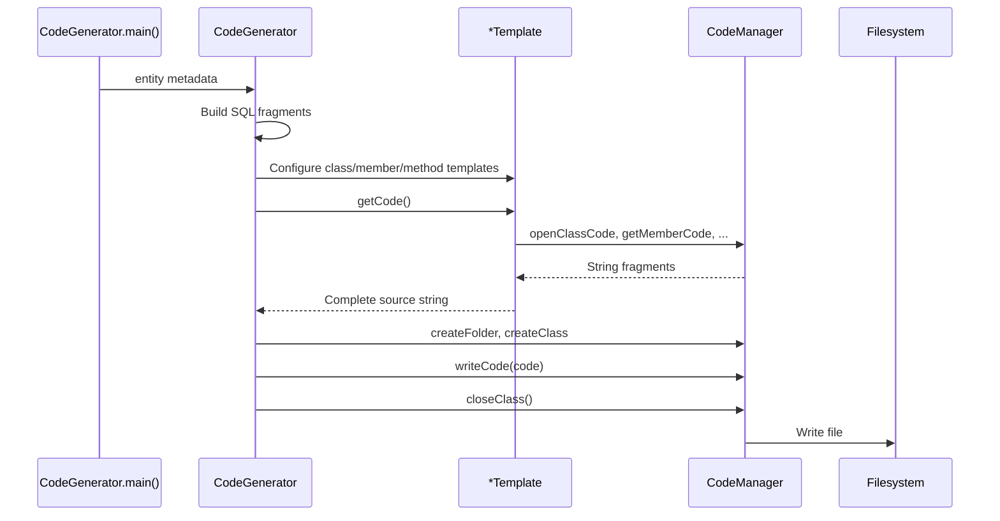

# GoldenRod Technical Design

This document describes the internal design of the GoldenRod code generator: class responsibilities, generation algorithms, data contracts, and output specifications.

## Package Map

```
org.archcorner.codegen
├── java
│   ├── CodeGenerator          # Entry point; orchestrates Java generation
│   ├── CodeManager            # File I/O and Java code string helpers
│   ├── ClassTemplate          # Class metadata
│   ├── MemberTemplate         # Field / constant metadata
│   ├── MethodTemplate         # Method metadata
│   ├── ParameterTemplate      # Parameter metadata
│   ├── PojoTemplate           # Assembles POJO source
│   ├── DAOTemplate            # Assembles JDBC DAO source
│   └── BusinessDelegateTemplate  # Assembles service delegate source
├── php
│   ├── CodeGenerator
│   ├── CodeManager            # PHP-specific helpers (openPHPCode, etc.)
│   ├── PojoTemplate, DAOTemplate
│   └── VariableTemplate       # PHP local variables
├── angular
│   ├── CodeManager            # HTML file I/O
│   ├── HTMLTemplate           # AngularJS page assembly
│   └── webservices.php
│       ├── CodeGenerator      # Same API as php; output → angular/php/
│       └── (same template set as php)
└── django
    ├── CodeGenerator          # Django scaffold writer
    ├── CodeManager            # Python file I/O
    └── ClassTemplate
```

## Core Data Contract

All CRUD generators share the same input parameters:

```java
String entity;              // "Partner", "Customer"
String idEntity;            // "PartnerId", "customerID"
String nameEntity;          // "PartnerName", "CUSTOMERNAME"
List<String> entityColumns; // DB columns excluding ID: ["PARTNERNAME", ...]
List<String> pojoMembers;   // Java/JS property names: ["partnerName", ...]
List<String> types;         // POJO only: ["int", "String", ...]
```

### Angular HTML additional inputs

```java
String app;                 // Angular module name: "customersApp"
String page;                // Page title prefix: "Customers"
String webservices;         // PHP endpoint filename
String webservicesUpdate;   // Update endpoint (edit form only)
```

### Django settings input

```java
Map<String,String> databaseConfiguration;
// Keys: ENGINE, NAME, USER, PASSWORD, HOST, PORT
```

## Generation Pipeline



## Java Module Design

### CodeGenerator

**`generatePojo(entity, members, types)`**

1. Create `PojoTemplate` with `ClassTemplate` named `{entity}`.
2. For each member, add a `MemberTemplate` with name and Java type.
3. `PojoTemplate.getCode()` emits: class declaration, private fields, getters, setters, empty `main`.
4. Write to `java/{Entity}.java`.

**`generateDAO(entity, idEntity, nameEntity, entityColumns, pojoMembers)`**

1. Build SQL strings programmatically:
   - `highestIDSQL`: `SELECT MAX({ENTITY}ID) AS MAX{ENTITY}ID FROM {ENTITY}`
   - `selectSQL`: lookup by name column
   - `selectIdSQL`: lookup by ID
   - `insertSQL`: `INSERT INTO {ENTITY}({ENTITY}ID, cols...) VALUES(?,...)`
   - `updateSQL`: `UPDATE {ENTITY} SET col=? ... WHERE {ID}=?`
   - `deleteSQL`, `selectAllSQL`
2. Configure `DAOTemplate` with SQL member constants and CRUD method templates.
3. `DAOTemplate.getCode()` generates JDBC code using `JDBCManager.getConnection()` / `closeConnection()`.
4. Write to `java/{Entity}DAO.java`.

**`generateBusinessDelegate(entity)`**

1. Create delegate class `{Entity}BusinessDelegate`.
2. Add private `{entity}DAO` member of type `{Entity}DAO`.
3. Generate wrapper methods: `getHighestId`, `insert`, `update`, `delete`, `getById`, `getByName`, `getAll`.
4. Each method creates a new `PartnerDAO` instance (no pooling or singleton).
5. Write to `java/{Entity}BusinessDelegate.java`.

### DAOTemplate — Generated DAO Methods

| Method | JDBC pattern | Notes |
|--------|--------------|-------|
| `getHighestId()` | `Statement.executeQuery` | Returns max ID for auto-increment insert |
| `get{Entity}ById(int)` | `PreparedStatement` + `ResultSet` loop | Maps row → POJO |
| `get{Entity}(String name)` | Lookup by name column | |
| `insert{Entity}(POJO)` | `getHighestId()+1` for new ID | Uses `execute()` |
| `update{Entity}(POJO)` | Parameterized UPDATE | |
| `delete{Entity}(POJO)` | DELETE by ID | |
| `get{Entity}s()` | SELECT * → `List<POJO>` | |

All methods follow try/catch/finally with connection cleanup.

### BusinessDelegateTemplate

Generates imports from `org.archcorner.chartreuse.dal.dao` and `org.archcorner.chartreuse.pojo`, then one-line delegations to DAO methods.

## PHP Module Design

### CodeManager — PHP Code Helpers

| Method | Output |
|--------|--------|
| `openPHPCode()` | `<?php \n` |
| `openClassCode(ClassTemplate)` | `class Name {` or `class Name extends Super {` |
| `closeClassCode()` | `}\n?>` |
| `getMemberCode(MemberTemplate)` | `private $_fieldName ;` |
| `getMemberGetterCode` | `public function getFieldName()` |
| `getMemberSetterCode` | `public function setFieldName( $fieldName )` |
| `getMethodCode(MethodTemplate)` | `public function methodName( $params )` |

### PojoTemplate

Same loop as Java: members → getters → setters. No `main` in PHP POJO output (optional static `main` stub in CodeManager demo).

### DAOTemplate (PHP)

Generates `{Entity}PDO` extending `DataObject`:

- `getMaxId()` — `SELECT MAX({ENTITY}ID)`
- `insert{Entity}($entity)` — named PDO binds (`:customerid`, `:name`, ...)
- `update{Entity}($entity)` — UPDATE with binds
- `delete{Entity}($entity)` — DELETE by ID
- `get{Entity}($id)` — single row fetch → POJO
- `check{Entity}Exists($entity)` — lookup by name
- `get{Entity}s()` — full table scan → array of POJOs

Connection lifecycle: `parent::connect()` / `parent::disconnect($connection)` per method.

### Output paths

| Generator package | Output directory |
|-------------------|------------------|
| `php` | `php/{ClassName}.php` |
| `angular.webservices.php` | `angular/php/{ClassName}.php` |

## Angular HTML Module Design

### HTMLTemplate page types

**List page — `getCode()`**

- Angular module and `{Entity}Ctrl` controller.
- `_refresh{Entity}()` calls GET on `webservices` endpoint.
- `ng-repeat` over `{entity}s` displaying each `entityColumn` (lowercased).
- Edit/Delete links with query-string ID: `edit{Entity}.html?id={{...}}`.

**Create form — `getFormCode()`**

- `customerForm` object bound with `ng-model`.
- `submit{Entity}()` POSTs JSON to `webservices` (e.g. `InsertCustomer.php`).
- `_clearFormData()` resets all `pojoMembers` fields.

**Edit form — `getEditFormCode()`**

- Parses ID from `$location.absUrl()` query string.
- POST to `Get{Entity}.php` to load record.
- POST to `Update{Entity}.php` on submit.
- Hidden input for ID field.

**Delete form — `getDeleteFormCode()`**

- Loads record via POST, displays confirmation message.
- POST to `Delete{Entity}.php`.

### Angular CodeManager

- `createHTML(path, className)` → `{path}/{className}.html`
- `openHTMLCode(appName)` → `<!DOCTYPE html>\n<html ng-app="{appName}">`
- `closeHTMLCode()` → `</html>`

### HTMLTemplate.main() generation order

For entity `Customer`:

1. `Customers.html` — list (GET `Customers.php`)
2. `CustomerForm.html` — create (POST `InsertCustomer.php`)
3. `EditCustomerForm.html` — edit (GET `GetCustomer.php`, POST `UpdateCustomer.php`)
4. `DeleteCustomerForm.html` — delete (POST `DeleteCustomer.php`)

## Django Module Design

### CodeGenerator methods

**`writeSettings(path, fileName, databaseConfiguration)`**

Emits a complete `settings.py` with:

- Standard Django 1.x/2.x app/middleware/template configuration
- `DATABASES['default']` populated from the configuration map
- Hard-coded `SECRET_KEY` and `DEBUG = True` (development defaults)

**`writeViews(path, fileName, message)`**

```python
from django.http import HttpResponse
def index(request):
    return HttpResponse("{message}")
```

**`writeUrls(path, fileName)`** — single-app urlpatterns.

**`writeUrls(path, fileName, urlPaths, urlPatterns)`** — project-level urlpatterns with parallel lists of paths and pattern expressions.

## SQL Generation Algorithm

Shared by Java, PHP, and Angular PHP DAO generators:

```
insertColumns = ENTITYID + "," + join(entityColumns, ",")
insertValues  = "?," repeated (columns + 1)
updateSet     = col1=?, col2=?, ... (no trailing comma on last)
```

ID column is always `{ENTITY}ID` in uppercase. Insert assigns `getHighestId()+1` / `getMaxId()+1` for auto-increment semantics.

## Generated File Naming Conventions

| Artifact | Pattern | Example |
|----------|---------|---------|
| Java POJO | `{Entity}.java` | `Partner.java` |
| Java DAO | `{Entity}DAO.java` | `PartnerDAO.java` |
| Java delegate | `{Entity}BusinessDelegate.java` | `PartnerBusinessDelegate.java` |
| PHP POJO | `{Entity}.php` | `Customer.php` |
| PHP DAO | `{Entity}PDO.php` | `CustomerPDO.php` |
| Angular list | `{Page}.html` | `Customers.html` |
| Angular create | `{Entity}Form.html` | `CustomerForm.html` |
| Angular edit | `Edit{Entity}Form.html` | `EditCustomerForm.html` |
| Angular delete | `Delete{Entity}Form.html` | `DeleteCustomerForm.html` |

## Running the Generators

GoldenRod is an Eclipse Java project (`.project`, `.classpath`). Build compiles sources to `bin/`, then run any `CodeGenerator.main()` or `HTMLTemplate.main()` from the IDE or CLI:

```bash
# From GoldenRod project root, after compiling:
java -cp bin org.archcorner.codegen.java.CodeGenerator
java -cp bin org.archcorner.codegen.php.CodeGenerator
java -cp bin org.archcorner.codegen.angular.HTMLTemplate
java -cp bin org.archcorner.codegen.angular.webservices.php.CodeGenerator
java -cp bin org.archcorner.codegen.django.CodeGenerator
```

Each `main()` uses hard-coded Partner/Customer metadata as a demo; production use requires parameterizing these values or extending the entry points.

## External Dependencies

| Dependency | Used by | Purpose |
|------------|---------|---------|
| `org.archcorner.chartreuse.util.JDBCManager` | Generated Java DAO | Connection management |
| `org.archcorner.chartreuse.pojo.*` | Generated Java DAO/Delegate | POJO package namespace |
| `org.archcorner.chartreuse.dal.dao.*` | Generated BusinessDelegate | DAO package namespace |
| `DataObject.php` | Generated PHP DAO | PDO connection base class (not in repo) |
| AngularJS 1.2.1 CDN | Generated HTML | Front-end framework |
| Django | Generated mysite | Python web framework |

## Known Implementation Characteristics

These behaviors are present in the current generated output and templates:

1. **New DAO instance per call** — BusinessDelegate creates `new PartnerDAO()` on every method invocation.
2. **Manual ID assignment** — Insert uses `MAX(id)+1` rather than database auto-increment/sequences.
3. **Exception handling** — Java DAOs print stack traces; PHP DAOs echo PDO exception messages.
4. **No input validation** — Generated CRUD code passes values directly to SQL.
5. **Duplicated template code** — PHP and `angular.webservices.php` packages mirror each other; no shared base module.
6. **Angular edit/delete templates** — Generated JavaScript in edit/delete forms has syntax issues (missing `url:` in `$http` calls, IIFE mismatch) visible in committed `EditCustomerForm.html` and `DeleteCustomerForm.html`.
7. **PHP naming inconsistency** — Generated Customer PDO calls `getZipCode()` / `setCustomerid()` while POJO defines `getZipcode()` / `setCustomerId()`.
8. **Django models not generated** — Only settings, views, and URLs are scaffolded; ORM models must be added manually.

## Extension Points

To add a new target stack or entity type:

1. Create a new package under `org.archcorner.codegen.{target}`.
2. Implement `CodeManager` with target-language string helpers and file extensions.
3. Implement `*Template` classes with a `getCode()` method.
4. Add `CodeGenerator` methods that accept the shared entity metadata contract.
5. Wire a `main()` method with sample metadata for testing.

To add a new CRUD operation to existing stacks, extend `DAOTemplate.getCode()` in each affected package and add corresponding method templates in `CodeGenerator.generateDAO()`.

## Sample Generated Output Reference

### Java POJO field pattern

```java
private int partnerId;
public int getPartnerId() { return partnerId; }
public void setPartnerId(int partnerId) { this.partnerId = partnerId; }
```

### PHP POJO field pattern

```php
private $_customerId;
public function getCustomerId() { return $this->_customerId; }
public function setCustomerId($customerId) { $this->_customerId = $customerId; }
```

### Angular list binding pattern

```html
<li ng-repeat="customer in customers">
  {{customer.customername}}
  {{customer.city}}
  ...
</li>
```

### JDBC insert ID assignment

```java
preparedStatement.setInt(1, getHighestId() + 1);
```

These patterns repeat for every entity passed through the generator metadata.
